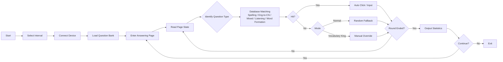

# FuckWeici

    

An automatic answering script for the Weici App. It implements Android automation based on uiautomator2, matching answers via a local question bank database and clicking them automatically.

## Workflow



# Installation & Execution

<p>
  <a href="https://github.com/66CF/FuckWeici/archive/refs/heads/main.zip">
    
  </a>
</p>

1. Click `Code → Download ZIP` to download the project and extract it.
2. Double-click `安装依赖.bat` (Install Dependencies) to install `uv`, `adb`, `gum`, and project dependencies.
3. Open the [MuMu Emulator](https://mumu.163.com/) or an Android phone and enter the answering page of [Weici](https://imtt.dd.qq.com/sjy.00022/sjy.00004/16891/apk/EC254B9AAA616B4D96F4C304CFA5F3EF.apk). For physical devices, USB debugging must be enabled and the computer must be authorized.
4. Double-click `启动.bat` (Start) and select the answering interval as prompted. It is recommended to choose `2 seconds` for the first time.

## Configuration

- **Question Bank Path**: Specified via the environment variable `FW_DB_PATH`, defaulting to `db/weici_ext459.db`.
- **Device Database Path**: `/data/data/com.android.weici.senior.student/databases/` (root permissions required to pull).
- **Answering Interval**: Selected via `gum choose` at startup to control the wait time between questions.

## Project Structure

```
├── main.py              # Main entry: config, device abstraction, answering strategy, CLI orchestration
├── database.py          # Question bank loading, data models, index construction, answer query
├── test_database.py     # Unit tests
├── pyproject.toml       # Project metadata and dependencies
├── 启动.bat             # Windows start script
├── 安装依赖.bat         # Windows auto-install script
└── db/                  # SQLite question bank directory
```

## Supported Question Types

| Type | Description |
|------|------|
| Spelling | Spell words based on phonetic symbols; automatically clicks virtual keyboard |
| Eng-to-Chi | See English and select the Chinese definition (choose one of three) |
| Mixed | A mix of context word selection, Chi-to-Eng, sentence completion, etc. |
| Listening | Listen to audio and select the word (choose one of three) |
| Word Formation | Select correct affixes to build compound words |

Supports automatic detection for the "Vocabulary King" endless mode (100 questions/level).

## Dependencies

- [uiautomator2](https://github.com/openatx/uiautomator2) — Android UI automation
- [gum](https://github.com/charmbracelet/gum) — Terminal selection, confirmation, initialization Spin, and Log output
