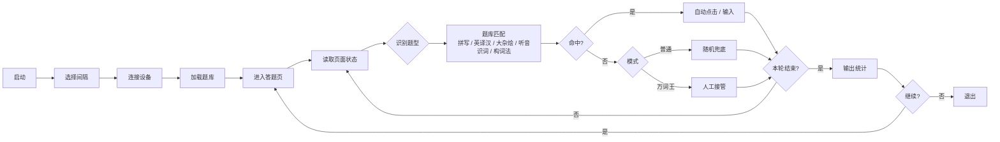

# FuckWeici

    

维词（Weici）App 自动答题脚本，基于 uiautomator2 实现 Android 端自动化，通过本地题库数据库匹配答案并自动点击。

## 工作流程



## 支持的题型

| 类型 | 说明 |
|------|------|
| 拼写题 | 根据音标拼写单词，自动点击虚拟键盘 |
| 英译汉 | 看英文选中文释义（三选一） |
| 大杂烩 | 语境选词、汉译英、补全句子等混合题型 |
| 听音识词 | 听音频选单词（三选一） |
| 构词法拼词 | 选择正确词缀拼出复合词 |

支持「万词王」无尽模式（100 题/关）自动检测。

## 安装与运行

<p>
  <a href="https://github.com/66CF/FuckWeici/archive/refs/heads/main.zip">
    
  </a>
</p>

1. 点击 `Code → Download ZIP` 下载项目并解压。
2. 双击 `安装依赖.bat` 安装 `uv`、`adb`、`gum` 和项目依赖。
3. 打开[MuMu 模拟器](https://mumu.163.com/)或安卓手机，进入[维词](https://imtt.dd.qq.com/sjy.00022/sjy.00004/16891/apk/EC254B9AAA616B4D96F4C304CFA5F3EF.apk)的答题页面。真机需要先开启 USB 调试并授权电脑连接。
4. 双击 `启动.bat`，按提示选择答题间隔。第一次建议选 `2 秒`。

## 配置

- **题库路径**：通过环境变量 `FW_DB_PATH` 指定，默认使用 `db/weici_ext459.db`
- **设备数据库路径**：`/data/data/com.android.weici.senior.student/databases/`（需 root 权限拉取）
- **答题间隔**：启动时通过 gum choose 选择，控制每题之间的等待时间

## 项目结构

```
├── main.py              # 主入口：配置、设备抽象、答题策略、CLI 编排
├── database.py          # 题库加载、数据模型、索引构建、答案查询
├── test_database.py     # 单元测试
├── pyproject.toml       # 项目元数据与依赖
├── 启动.bat             # Windows 启动脚本
├── 安装依赖.bat         # Windows 自动安装脚本
└── db/                  # SQLite 题库目录
```

## 依赖

- [uiautomator2](https://github.com/openatx/uiautomator2) — Android UI 自动化
- [gum](https://github.com/charmbracelet/gum) — 终端选择、确认、初始化 Spin 与 Log 输出
